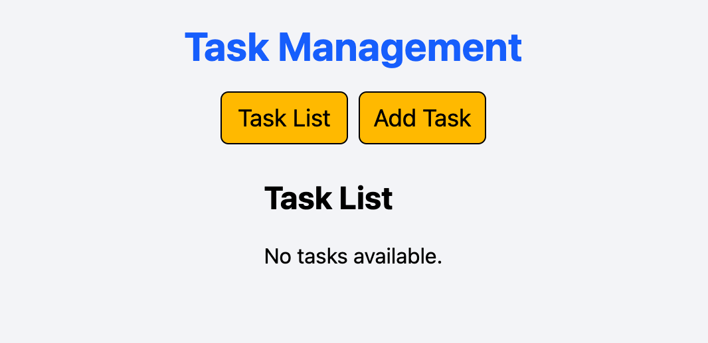
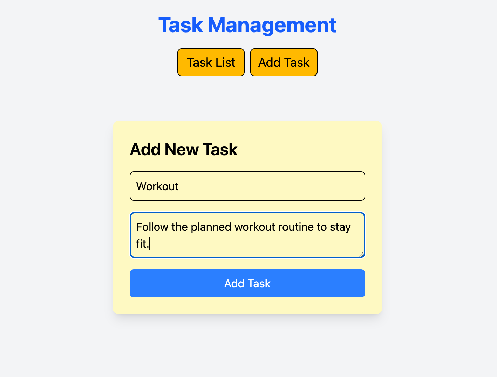
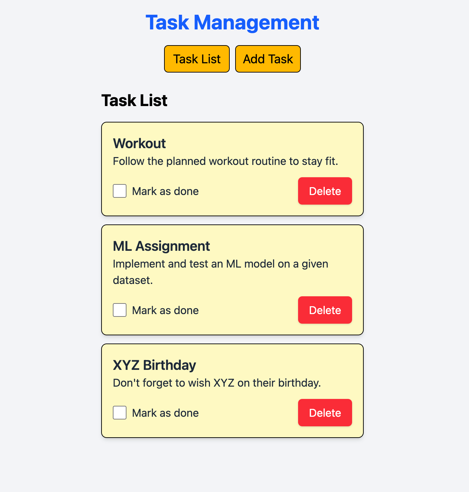
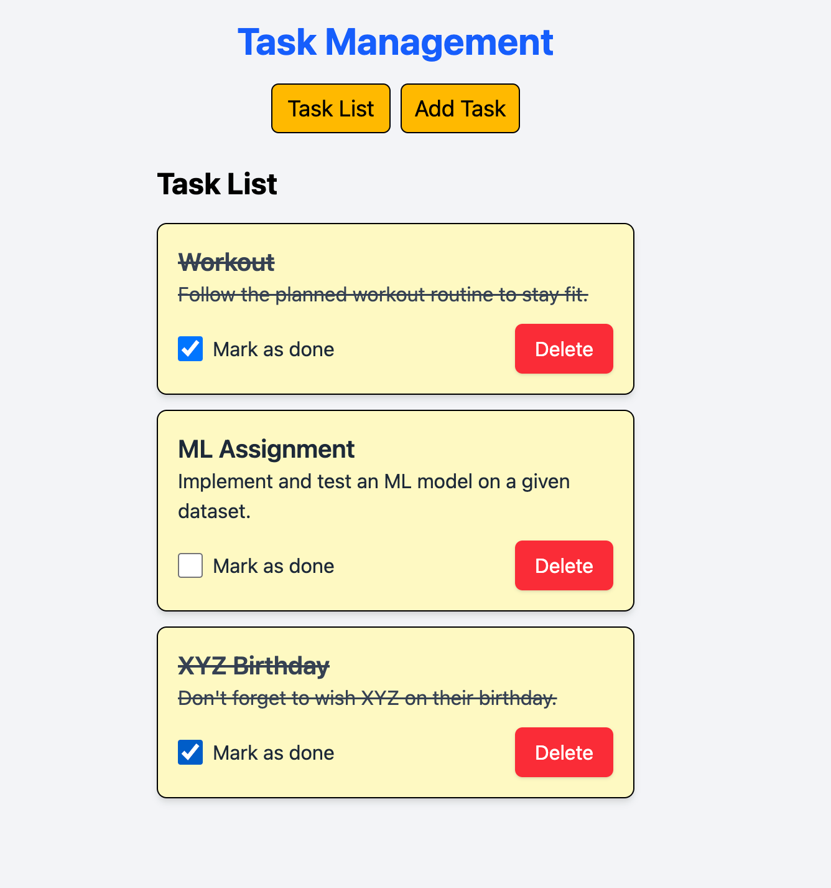
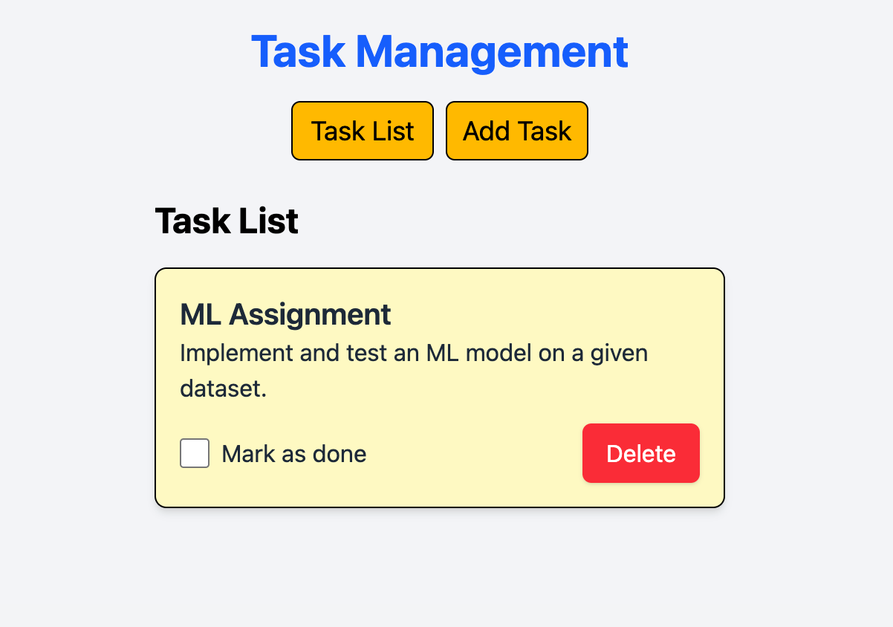

# Task Management App

## Overview

This is a simple Task Management application built with React.js for the frontend, Node.js for the backend, and MongoDB for data persistence, with Axios handling API communication.

The application allows users to:

- View a list of tasks
- Add new tasks
- Mark tasks as completed
- Delete tasks

## Features

- Add new tasks with a title and description
- Mark tasks as completed
- Delete tasks
- Persist task data using a backend API
- Styled with Tailwind CSS for a clean and modern UI

## Tech Stack

- **Frontend:** React.js, React Router, Axios, Tailwind CSS
- **Backend:** A REST API (expected to be running on `http://localhost:3000`)
- **State Management:** React Hooks (`useState`, `useEffect`)

## Installation & Setup

### 1. Clone the Repository

```sh
git clone https://github.com/Aayush1805/Task-Management.git
cd Task-Management
```

### 2. Install Dependencies

```sh
npm install
```

### Note:
Create a mongodb url for real time data persistence and make sure to update in db.js


### 3. Run the Application

### a. backend
```sh
node index.js
```
### b. frontend
```sh
npm run dev
```

This will start the React development server at `http://localhost:5173` (or another available port).

## Folder Structure

```
📁 task-management/
│-- 📁 src/
│   │-- 📁 Components/
│   │   │-- Task.jsx
│   │-- 📁 Pages/
│   │   │-- AddTask.jsx
│   │   │-- TaskList.jsx
│   │-- App.jsx
│   │-- index.js
│-- package.json
│-- README.md
```

## API Endpoints (Expected Backend)

| Method | Endpoint     | Description                   |
| ------ | ------------ | ----------------------------- |
| GET    | `/tasks`     | Fetch all tasks               |
| POST   | `/tasks`     | Add a new task                |
| PUT    | `/tasks/:id` | Update task completion status |
| DELETE | `/tasks/:id` | Delete a task                 |

## Usage

1. Navigate to `http://localhost:5173/`
2. Click **Add Task** to create a new task.
3. View the task list, mark tasks as completed, or delete them.

## Screenshots



 
 

